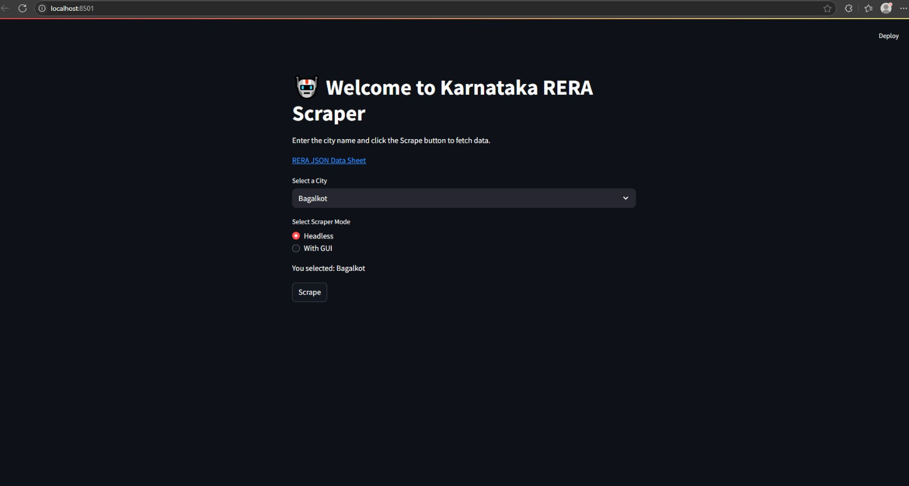

# **Karnataka RERA Website Scraper**

## **Overview**
This project scrapes detailed information from the Karnataka RERA website, providing comprehensive data on real estate projects and their associated entities. The tool is designed to extract valuable information for analysis, compliance, and reporting.



## Table of Content
1. [Overview](#Overview)
2. [Features](#Features)
3. [Requirements](#Requirements)
4. [Prerequisites](#Prerequisites)
    1. [Create virtual Environment](#create-virtual-environment)
    2. [How to create credentials.json](#how-to-create-credentialsjson)
    3. [Download Docker Desktop](#download-docker-desktop)
5. [How to Run](#how-to-run)
6. [DEMO](#DEMO)
    * [Scraper Instructions](#scraper-instructions)

## **Features**
The scraper extracts the following details:

### 👉 Project Details
- **Promoter Details**: Information about the promoter of the project.
- **Authorized Signatory Details**: Details of the authorized signatories for the project.
- **Project Member Details**: Data on members associated with the project.
- **Project Land Owner Details**: Information about the owners of the land used for the project.

### 👉 Registration and Compliance
- **RERA Registration Details with any other State/UTs**: Registration details from other states/UTs if applicable.
- **Previous Project Details (Last 5 Years Only)**: History of projects completed by the promoter in the last 5 years.

### 👉 Project Information
- **Project Details**: General information about the project.
- **Development Details**: Details about the project's internal development.
- **External Development Work**: Work related to external development.
- **Other External Development Work**: Additional external development activities.
- **Project Bank (Escrow Account) Details**: Information about the project's escrow account.
- **Project Approval**: Details of approvals obtained for the project.
- **Declaration**: Official declarations related to the project.

### 👉 Documents and Media
- **Pan Card**: Pan card details of the promoter.
- **Other Documents**: Additional documents associated with the project.
- **Project Photo**: Images of the project.
- **Uploaded Documents**: All uploaded documents for compliance.
- **Photos Uploaded**: Photos submitted to RERA.

### 👉 Financial and Administrative Data
- **Balance Sheet**: Financial details related to the project.
- **Project Agents**: Details of agents associated with the project.

### 👉 Additional Information
- **Project Table**: A summary table of project details.
- **Complaints on this Promoter**: Complaints filed against the promoter.
- **Complaints on this Project**: Complaints related to the project.
- **Completion Details**: Data about project completion milestones.

## **Requirements**
- Python 3.x
- Selenium
- ChromeDriver
- Other required dependencies listed in `requirements.txt`.

## **Prerequisites**

### Create virtual Environment
```python
conda create -p env python=3.10 -y
```

### How to create credentials.json
[Watch the Video to how to create credentials.json](https://youtu.be/k_PB4ORz2r0?si=aIw30wu4buzkaPB-)

### Download Docker Desktop
[Download Docker Desktop](https://www.docker.com/products/docker-desktop/)

## **How to Run**

```python
streamlit run ./main.py
```

## **DEMO**


### **Scraper Instructions**

1. **Select the City**  
   Choose a city from the dropdown menu.

2. **Scrape Button**  
   Click on the **"Scrape"** button to start the scraping process.

3. **Mode Selection**  
   - **Headless Mode**: The scraping process runs in the background without displaying the browser UI.  
     _Recommended for faster and smoother execution._
   - **With GUI**: The Chrome browser UI will appear, and the scraping process will happen visibly.  
     _Suitable for observing the scraping process in real time._
